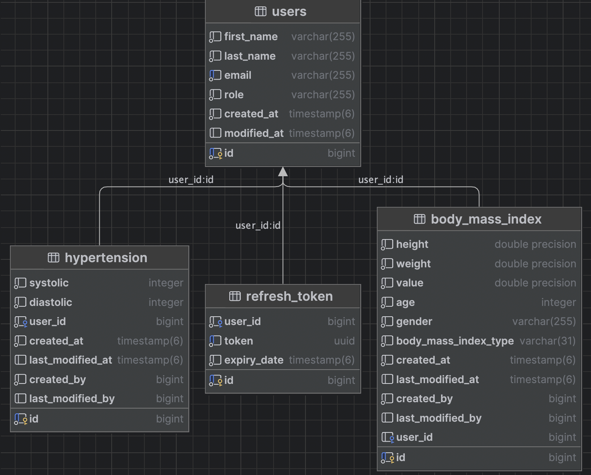

# Health Tracker

### Description

Health Tracker is a cutting-edge mobile application designed with one primary goal: to empower users in effortlessly monitoring and managing their health. By seamlessly tracking vital parameters such as blood pressure, Body Mass Index (BMI), and other key health metrics, Health Tracker becomes your trusted companion on your journey to better health.

This intuitive app streamlines the process of recording and managing your health data. It simplifies the task of logging blood pressure measurements, providing you with an extensive historical record that can be shared with healthcare professionals for more informed discussions and personalized care plans.

In addition to precise blood pressure monitoring, Health Tracker offers a sophisticated BMI calculator, allowing you to assess your weight status and chart your progress towards achieving your fitness goals. The app provides tailored insights and recommendations based on your data, assisting individuals in managing chronic health conditions or maintaining an active and balanced lifestyle.

### Prerequisites

### How to start application

### Database schema

### Reference Documentation

For further reference, please consider the following sections:

* [Official Gradle documentation](https://docs.gradle.org)
* [Spring Boot Gradle Plugin Reference Guide](https://docs.spring.io/spring-boot/docs/3.0.5/gradle-plugin/reference/html/)
* [Create an OCI image](https://docs.spring.io/spring-boot/docs/3.0.5/gradle-plugin/reference/html/#build-image)
* [Rest Repositories](https://docs.spring.io/spring-boot/docs/3.0.5/reference/htmlsingle/#howto.data-access.exposing-spring-data-repositories-as-rest)
* [Spring Data JPA](https://docs.spring.io/spring-boot/docs/3.0.5/reference/htmlsingle/#data.sql.jpa-and-spring-data)

### Additional Links

These additional references should also help you:

* [Gradle Build Scans – insights for your project's build](https://scans.gradle.com#gradle)